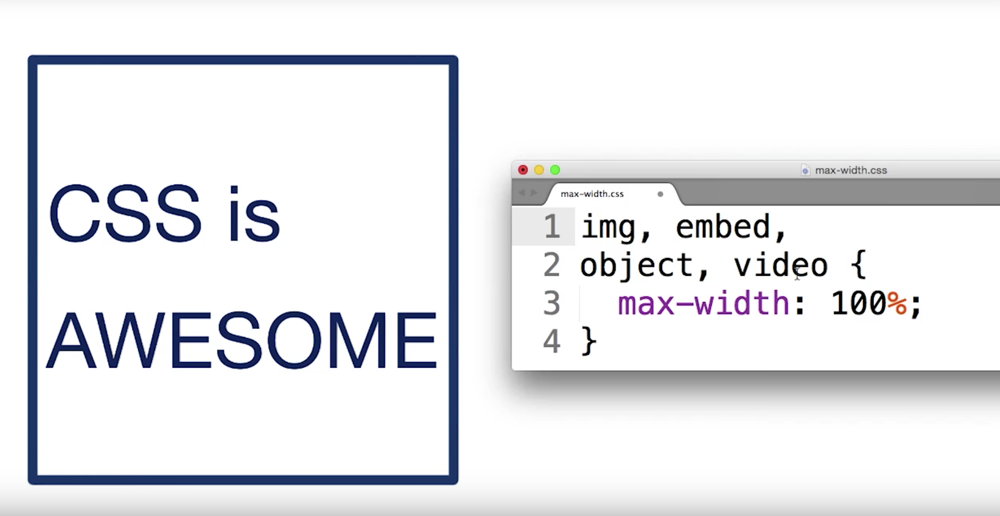

# 100 Days Of Code - Log (Round 3)
<<<<<<< HEAD
---
### Day: June 3, 2018

**Today's Progress**  FEND...Project 2?

**Thoughts:** Trying to focus on my last lessons.

---

||||||| merged common ancestors
--
=======

---

### Day 29: May 29, 2018

**Today's Progress**  The DOM (FEND)

**Thoughts:** A few quick notes on the DOM: 1. HTML is received, 2. HTML tags are converted to tokens, 3. tokens are converted to Nodes, 4. Nodes are converted to the DOM. 

---

>>>>>>> b8118a535a755a952940cb612c027ed1a91e6a48
### Day 25: May 25, 2018

**Today's Progress**  SP Lightbox & Slider

**Thoughts:** Finally complete the demo code portion of my SP Code Repo for work.  

---
### Day 21: May 21, 2018

**Today's Progress** 

**Thoughts:** 

---
### Day 20: May 18, 2018

**Today's Progress** Tabbed Carousel & Video Lightbox

**Thoughts:** 

---

### Day 19: May 17, 2018

**Today's Progress** Tabbed Carousel & Shopify Wesbiste

**Thoughts:** Used some of the skills taught from FEND degree to make the tabbed SP carousel responsive by leveraging flexbox.  Can't wait to spend more time learning but for now, I'm extremely busy.  Finished a mock e-commerce site last night.  The business owner is pleased but I know I can take the site to the next level once I understand the code behind Shopify. 

[Shopify Store Preview](https://3chv2v5jd33klhwm-7882735673.shopifypreview.com/)

---
### Day 18: May 16, 2018

**Today's Progress** GWG Project #1 & SP Lightbox COMPLETED!!

**Thoughts:** I finally completed my first GEG project on Saturday and received the review pretty quickly. I attempted to submit the Picel project, but it is not passing the test. I will try again soon but I'm not too thrilled to revisit the code. At work, I finally figured out how to pull rest API data into my SP light box from an asset library. Yay!

---
### Day 17: May 11, 2018

**Today's Progress** SP Light Box & FEND Portfolio

**Thoughts:** I missed the deadline but still moving forward on the FEND degree.  Made major progress with the SP Light box by integrating the rest API call.

---
### Day 16: May 10, 2018

**Today's Progress** SP Light Box & FEND Portfolio

**Thoughts:** Pushing close to my FEND deadline.  I will update later... 

---
### Day 16: May 9, 2018

**Today's Progress** More Flex-box CSS & FEND Optimizations

**Thoughts:** Took what I learned from the FEND flex box tutorial to design a responsive light box to hold images.  Also started a new FEND tutorial about optimizing images, tables, and fonts to improve responsive layouts.    

---
### Day 15: May 8, 2018

**Today's Progress** Flex-box CSS & SharePoint development

**Thoughts:** Small victory at work!  I made my first SP list integrated accordion.  And it's pretty nice looking, if I can say so myself.  FEND: Going through the flex-box tutorials and anxious to finish my first project.   

---
### Day 14: May 7, 2018

**Today's Progress** BOSS women's community website and SharePoint development.

**Thoughts:** Short log today but I was able to make my volunteer website mobile friendly and I'm researching how to develop a CMS UI.  

---
### Day 13: May 6, 2018

**Today's Progress** FEND lessons and started volunteer work on a local women's community website.

**Thoughts:** I used [Webflow](https://webflow.com/design/bandofsisters#) for the very first time today and I'm very handicapped using it.  I'm trying to understand the software and it is becoming a little easier.  It's a great too for HTML and CSS but I'm not sold on using JS. It did not feel natural...I rather just embed code than fidget around the editor. 

---
### Day 12: May 5, 2018

**Today's Progress** FEND Web Foundations Lesson 13 and freelance work for a used appliance store.

**Thoughts:** Hoping to make the portfolio deadline in FEND.  Hopefully I can complete the lessons and project tomorrow.  Moving forward with developing a website for a used appliance store.  The plan is to use Google Site integrated with Shopify.  This should make a quick setup but easy for the store owner to update information without the assistance of a web developer.

**Notes:** 
- Buttons should be at least 48px x 48px and 40px of margin (padding: 1.5em;) for improved responsiveness on mobile and tablet devices.
- Keep your element position relative.  Absolute positioning is a nightmare. Img, embed, object and video should be set to max-width: 100%; to be safe. 

- Prioritize content - Start small screen to big screen. #PerformanceMatters

---
### Day 11: May 4, 2018

**Today's Progress** Submitted the my first project for the FEND Nanodgree and started freelance work on a spa website. 

**Thoughts:** Moving at a slow pace on my Udacity course...and I was just notified that I received the scholarship for data science too! Whew! Good news but a lot of hard work coming my way. After receiving so much information at the Grow with Google event, I'm going to leverage the business website tool for a quick turnaround project. [Google Webmasters](https://www.google.com/webmasters/#?modal_active=none).

---
### Day 5: May 2, 2018

**Today's Progress** Grow With Google Event (Columbia, SC) [Grow With Google Event](https://events.withgoogle.com/join-google-in-columbia/ )

**Thoughts:** Over the moon to attend my first Google event today.  My first class is Get Found on Google Search and Maps.  

**Get Found on Google Maps:** The Google My Business (free) is only available for current permanent business.  Set up your business account on  [Business Verification](https://www.gybo.com/business).  You can also set up a Google Voice account to receive messages outside of a cell phone. You can integrate Shopify/eCommerce to the Google website. 

**Intro to Online Marketing:** 
- Create "How to" videos, "Top 10" lists and educational material for improved searches on google.com.
- Ensure a geo location is added to business for "near me" searches. 
- Ensure the NAP is accurate (Name, Address, Phone) and consistent on all platforms. 
- Google virtual photographer is available to make panoramic picture for the "virtual tour".
- Before you begin, make a plan: 1)Why do you want a website? 2)Who is your target audience? 3)How will you reach them? 4)How will you measure success?
- Google Search Console [Google Webmasters](https://www.google.com/webmasters/#?modal_active=none).
- Use [Google Trends](https://trends.google.com/trends/) to search the latest buss words and hot topics. 
- Social Media Marketing: Focus on education, inspiration and entertainment.  
- Email Marketing: Should be a natural, organically grown mailing list.  Ensure the email is mobile responsive.  *Key: A great subject line! 
- Test your mobile speed [Google Test Site](https://testmysite.thinkwithgoogle.com/). 
- [AdWords Express](gybo.com/awexpress) 
- [Google Analytics](google.com/analytics) Must load the analytics tracking onto the website. 
- [Google Partners](https://www.google.com/partners/)

**Intro to Code:** Learned how to make a sidebar UI withing Google Sheets by leveraging Google Apps Script [Google Apps Script](developers.google.com/apps-script/guides/dialogs#custom_sidebars)

---
### Day 4: April 27, 2018

**Today's Progress** Go Army Carousel & Code Repository 

**Thoughts:** Made more progress on the carousel but I cannot get the right scroll effect yet.  I'm also creating a code repository with useful SharePoint code snippets to assist Knowledge Systems Engineers at work.  

**Projects:** 
[Go Army Carousel (CodePen)](https://codepen.io/MoHampton/pen/pVEdMo)

---
### Day 3: April 26, 2018

**Today's Progress** Volunteer work for a local women's support group & hacking a jCarousel from the GoArmy official webpage.  

**Thoughts:** Unfortunately, I was not able to study my Udacity course today but I was able to get the ground work of two new projects started.  I forked a nice layout for the women's group from [TechNext](https://github.com/technext/labs).  Can't wait to get the website up and running. 

**Projects:** 
[Go Army Carousel (CodePen)](https://codepen.io/MoHampton/pen/pVEdMo)
[Women's Community Website (github)] (https://github.com/MoHampton/100DaysofCode-Round3)

---
### Day 2: April 25, 2018

**Today's Progress**: Went back to complete lessons 3 & 6 in Udacity but was quickly pulled away to focus on building a vanilla JS accordion.

**Thoughts:** Good so far...should have more time tomorrow to actually update my thoughts and links to training. 

**Link to training:** 

---
### Day 1: April 24, 2018

**Today's Progress**: Started the Udacity FEND Nanogdegree curriculum.  Updated a SharePoint Contacts application.

**Thoughts:**  

**Training**:[SPFx Youtube Video](https://www.youtube.com/watch?v=N1Z5XDLZ0J8&feature=youtu.be)
**Work**: [Free Code Camp Tribute Page](https://codepen.io/MoHampton/full/GMVWLy)

---

<!--### Day 3: November 19, 2017

**Today's Progress**: The FreeCodeCamp JavaScript module is dooooonnnneee!  Moving on to Object Oriented and Functional Programming next. Broke my "Hello World" webpart to better understand how SharePoint works with React. Started reviewing SQL Database Fundamentals on the Microsoft Virtual Academy.

**Thoughts:** Feeling pretty good about completing the JavaScript but I still have a lot to learn and topics to review as a refresher.

**Training** [MVA SQL Fundamentals](https://mva.microsoft.com/en-US/training-courses/sql-database-fundamentals-16944?l=w7qq6nAID_6805121157)

---

### Day 4: November 20, 2017

**Today's Progress**: Reviewed LeanKit Kanban tutorial and brushed up on SCRUM. Reviewed more of the SharePoint Framework and broke my "Hello World" web part for fun. 

**Thoughts:** Started my new job as a SharePoint Developer today.  My PM asked about REST APIs and I'm so glad I was able to answer his question based on studying the day before. 

**Training:** [LeanKit Tutorial](https://support.leankit.com/hc/en-us/articles/204413443-Lesson-1-How-LeanKit-Works-The-Concept)

---

### Day 5: November 21, 2017

**Today's Progress**: Completed FreeCodeCamp excercises on Object Oriented and Functional Programming and started Basic Algorithm Scripting.  Also reviewed Microsoft InfoPath Forms Services.

**Thoughts** The algorithm scripting excercises were challenging but rewarding after I completed a few -- very time consuming.  Researched InfoPath Form Services and quickly learned that Microsoft is no longer continuing development but will support the program until 2023.  The Microsoft Ignite conference in September, recommended using PowerApps as a replacement.

**Work:**
1. [Reverse A String](https://www.freecodecamp.org/challenges/reverse-a-string)
2. [Factorialize a Number](https://www.freecodecamp.org/challenges/factorialize-a-number)

**Training:** 
1. [Microsoft InfoPath](https://support.office.com/en-us/article/Find-content-about-InfoPath-2010-and-2013-A7BDD91D-02B4-4596-A22A-2BAD4DE69835#__toc349315878)
2. [Microsoft Ignite PowerApps](https://www.youtube.com/watch?v=sGFo6XslZ2I)-->

---
## Contents
* [My Daily Log](log.md)
* [Resources](resources.md)

---
